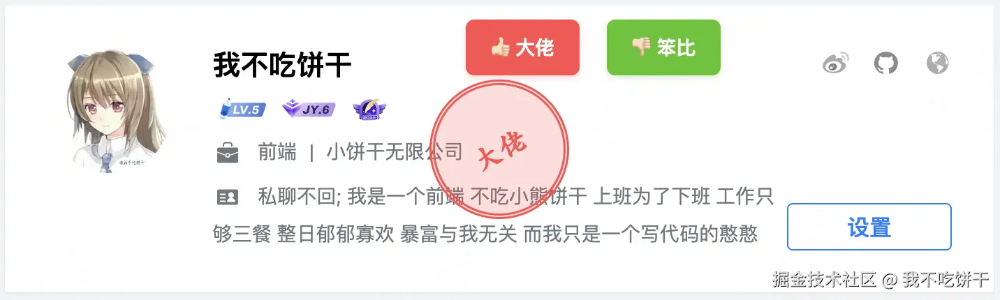

# 掘金用户标签管理

为掘金用户添加标签功能的油猴脚本。

## 功能特性

- 🏷️ 为用户添加自定义标签
- 👍 支持点赞标记（红色主题）
- 👎 支持点踩标记（绿色主题）
- 📍 在文章列表、评论区、个人主页显示标签
- 💾 本地存储，数据持久化

## 安装方法

1. 安装 [Tampermonkey](https://www.tampermonkey.net/) 浏览器扩展
2. 点击 [安装脚本](https://github.com/idonteatcookie/juejin-user-tags/raw/main/index.user.js)
3. 在 Tampermonkey 中确认安装

## 使用方法

1. 访问掘金用户主页
2. 点击"大佬"或"笨比"按钮
3. 输入自定义标签文本
4. 标签会在各个页面自动显示

## 截图

## 支持

如有问题请提交 [Issue](https://github.com/idonteatcookie/juejin-user-tags/issues)